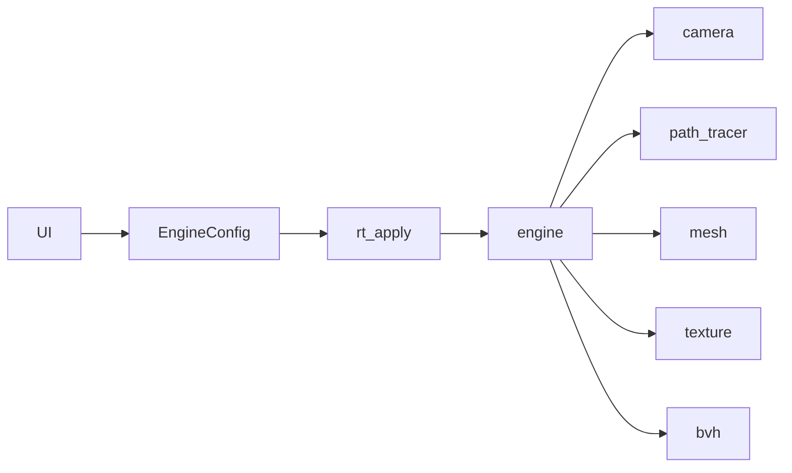

# cpp-003 架构

## 系列

002：能量怎么积。003：资产怎么进。

```mermaid
flowchart LR
  UI --> Cfg[EngineConfig]
  Cfg --> rt_apply
  rt_apply --> engine
  engine --> camera
  engine --> path_tracer
  engine --> mesh
  engine --> texture
  engine --> bvh
```

## 新增

- `mesh.h` 三角 MT + cube/crystal
- `texture.h` solid/checker/uv/image
- `material` 朗伯读纹理
- `hit_record.u/v`
